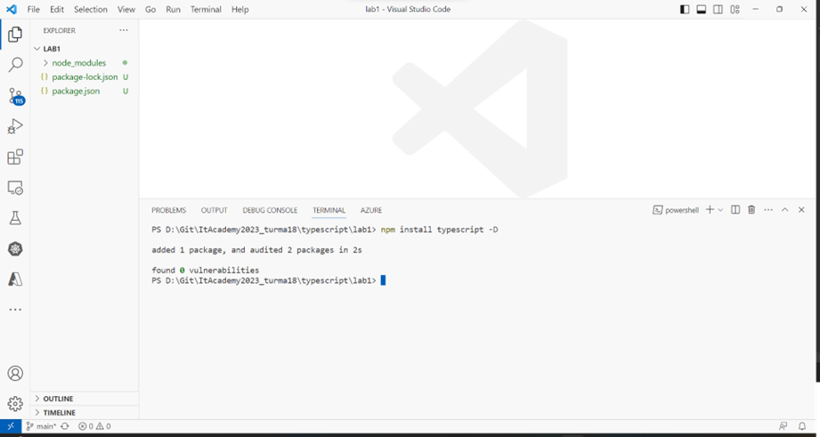

# Sistema de Folha de Ponto

Este é um projeto base desenvolvido com as configurações inicias do **TypeScript**, utilizando **ECMA2023**, **Nodemon**, **@types/node**, **ts-node**, configuração base para o **tsconfig.json** para gerenciamento de tráfego.

---

## **Requisitos**

1. **Node**

2. **Visual Studido Code**

---

## **Configurando Projeto**

1. Abra o *Visual Studio Code* e crie um novo diretório “lab1” dentro do seu repositório GIT criado anteriormente.

2. Abra uma linha de comando dentro do novo diretório. Utilize *CTRL+’* para abrir o terminal embutido do *Visual Studio Code*.

3. Inicialize o projeto *Node* com o seguinte comando para criar um arquivo “package.json”:

    ```bash
    npm init -y


    

4. Adicione o TypeScript localmente ao novo projeto (dessa forma você pode trabalhar com versões diferentes em cada projeto, sem entrar em conflito com uma instalação global) através do seguinte comando (a opção de instalação indica que o TypeScript é uma dependência de tempo de desenvolvimento que não afetará dependência de tempo de execução/produção do projeto):
    ```bash
    npm install typescript -D
    ou
    npm install typescript --save-dev

    

5. Observe as alterações efetuadas no arquivo “package.json” e a criação do subdiretório “node_modules” com os pacotes do TypeScript.

6. Verifique se o compilador do TypeScript está executando através do comando:
    ```bash
    npx tsc -v

    

7. Acrescente um arquivo “tsconfig.json” com as opções de compilação do TypeSript através do comando:
    ```bash
    npx tsc --init

    

8. Abra o arquivo “tsconfig.json” e observe todas as opções disponíveis. Realize as seguintes alterações:
    •	Troque a opção "target" para "es2022"
    •	Troque a opção "module" para "Node16"
    •	Descomente a linha "lib" e edite para: "lib": ["es2023"]
    •	Descomente a linha "moduleResolution" e edite para: "moduleResolution": "node16"
    •	Descomente a linha "sourceMap": true
    •	Descomente a linha "outDir": "./" e edite para: "outDir": "./dist"
    •	Descomente a linha "rootDir": "./" e edite para: "rootDir": "./src". Crie o subdiretório “src” dentro do projeto.
    •	Acrescente novas propriedades após a “}” que fecha a propriedade "compilerOptions" (observe a imagem a seguir):
    "include": ["src/**/*"],
    "exclude": ["**/*.spec.ts", "**/*.test.ts"]

    

Observação: alternativamente, utilize um arquivo de configuração base já padronizado para diversos ambientes de desenvolvimento de acordo com a documentação disponível em https://www.typescriptlang.org/docs/handbook/tsconfig-json.html 

9. Instale o ambiente de execução TypeScript para Node ts-node (https://typestrong.org/ts-node/) via o comando:
    ```bash
    npm install ts-node -D
    ou
    npm install ts-node --save-dev

    

10. Adicione o arquivo de definição de tipos TypeScript (arquivos “*.d.ts” serão instalados no diretório “node_modules/@types”) para a biblioteca do Node através do seguinte comando:
    ```bash
    npm install @types/node -D
    ou
    npm install @types/node --save-dev

    

11. Instale o nodemon (https://nodemon.io/) para automatizar o processo de compilação a cada alteração de arquivo-fonte via o comando:
    ```bash
    npm install nodemon -D
    ou
    npm install nodemon --save-dev

    

12. Abra o arquivo “package.json” e localize a seção “scripts”. Iremos alterar essa seção para configurar os comandos de compilação e execução do projeto via NPM. O resultado desejado será dois comandos para executar a aplicação “index” em modo de desenvolvimento e de produção:
    •	“npm run dev” para iniciar a aplicação em modo de desenvolvedor com nodemon habilitado; nesse ambiente, qualquer alteração no código-fonte da aplicação será automaticamente refletido em uma nova execução.
    •	“npm run start” para executar a aplicação com o código TypeScript do projeto via ts-node.
    •	“npm run build” para compilar a aplicação em código JavaScript para posterior distribuição e execução via node.

    "scripts": {
        "test": "echo \"Error: no test specified\" && exit 1",
        "dev": "nodemon src/index.ts",
        "start": "ts-node src/index.ts",
        "build": "tsc"
    }

13. Crie um novo arquivo “.gitignore” na raiz do diretório do projeto (junto aos arquivos de configuração *.json” com o seguinte conteúdo. Esse arquivo irá indicar o conteúdo que não deve ser enviado para o repositório Git.

    `node_modules
    dist
    *.log`

---

## **2 Codificando o projeto**

1. Crie um arquivo “index.ts” no diretório “src” do projeto. Utilize o seguinte código:

`let saudacao: string = 'Alô, mundo!';
console.log(saudacao);`

2. Abra um terminal, execute o seguinte comando e observe o resultado:
    ```bash
    npm run start

3. Abra um terminal e execute o comando:
    ```bash
    npm run dev

4. Execute qualquer alteração no arquivo “index.ts” e verifique que a mesma automaticamente se torna ativa ao salvar. Utilize CTRL+C no terminal para sair do nodemon.

5. Abra um terminal e execute o comando:
    ```bash
    npm run build

6. Observe o resultado dentro do diretório “dist”: dois novos arquivos devem ter sido criados, um “index.js” e um “index.js.map” que possui o suporte necessário para habilitar a depuração de código via um debugger.


---

## **3 Depurando o projeto**

1. Clique no canto esquerdo da linha “console.log” no arquivo “index.ts” para habilitar um ponto de parada.

    

2. Na janela do Visual Studio Code clique no ícone de depuração (o ícone do “bug”) e selecione “Run and Debug” para iniciar o processo de configuração do depurador.

    

3. Como não temos um arquivo de configuração de ambiento no Visual Studio Code, será solicitado que se indique o ambiente de depuração adequado. Selecione “Node.js”.

    

4. Pronto. Agora estamos depurando a aplicação.

    


---
